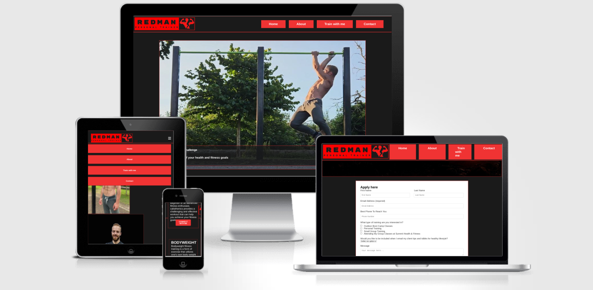

# REDMAN PERSONAL TRAINER
Welcome to Redman Personal Training, your gateway to a healthier, fitter, and more vibrant you! Located in Dublin, we specialize in calisthenics, bodyweight training, mobility exercises, and yoga to help you achieve your fitness goals. 

Led by Redman, a dedicated practitioner and expert in these disciplines, our mission is to empower you on your fitness journey by providing personalized training programs tailored to your unique needs and abilities.

[View Redman Personal Training live project here]((https://yakivbrychuk.github.io/Redman_Personal_Training-P1/index.html))
- - -
## Table of Contents

## User Experience (UX)

### User Stories
* First-time visitor goals
    * Quickly grasp the unique value of Redman Personal Training.
    * Effortlessly navigate through the website to explore services and information.
    * Easily initiate their fitness journey by filling out the "Train with Me" form.

* Returning visitor goals
   * Access updated information about training programs and services.
   * Find contact details to get in touch with the Redman team for further assistance.

* Regular clients 
   * Stay informed about new training packages and updates.
   * Revisit the gallery to see the latest success stories and motivational content.

- - --

## Features

* Redman Personal Training is designed for individuals seeking a transformative fitness journey in Dublin.
* Prospective clients can embark on this journey by navigating to the "Train with Me" page and submitting a    detailed form to tailor their personalized fitness plan.
* Optimized for seamless functionality across all device sizes, ensuring an engaging and accessible experience for every user.

### Existing Features
* Responsive and intuitive navigation menu.
* Detailed service descriptions to cater to all fitness levels and interests.
* A user-friendly form on the "Train with Me" page, inviting visitors to start their fitness journey.
* Contact information readily available for inquiries or further engagement.
#### Home page

#### Navigation

#### About page

#### Navigation

#### Train with me page

#### Thank You page

## Features Left to Implement

* Regularly updated gallery showcasing client transformations and motivational content.
* An interactive calendar for scheduling sessions directly through the website.

## Design

 * Colour Scheme
    * Primary colors used on the website: 

 * Typography
    * Montserrat font is main font used throughout the ite with sans-serif as its fallback font.

 * Wireframes
    * Pen and paper in a notebook: simple and effective.
---

## Technologies Used

 * [HTML5](https://en.wikipedia.org/wiki/HTML5)
 * [CSS3](https://en.wikipedia.org/wiki/CSS)

---

## Frameworks, Libraries & Programs Used

 * [Gitpod](https://www.gitpod.io/)
    * To write the code.
 * [Git](https://git-scm.com/)
    * for vesion control.
 * [Github](https://github.com/)
    * Deployment of the website and storing the files online.
 * [Google Fonts](https://fonts.google.com/)
    * Import main font the website.
* [Am I Responsive](https://ui.dev/amiresponsive)
    * Mockup picture for the README file.
---

## Testing

The W3C Markup Validator and W3C CSS Validator services were used to validate every page of the project to ensure there were no errors.

 * [W3C Markup Validtor](https://validator.w3.org/)
 * [W3C CSS Validator](https://jigsaw.w3.org/css-validator/)

## Unfixed Bugs

* Unable to find the css parameter responsible for "Navigation bar differs on certain pages."

### Validation results

### Manual Testing

### Lighthouse Report

## Deployment and local development

### GitHub Pages

GitHub Pages used to deploy live version of the website.
1. Log in to GitHub and locate [GitHub Repository Redman_Personal_Training]([https://github.com/Thomas-Tomo/Lunar-Escape](https://yakivbrychuk.github.io/Redman_Personal_Training-P1/index.html))
2. At the top of the Repository(not the main navigation) locate "Settings" button on the menu.
3. Scroll down the Settings page until you locate "GitHub Pages".
4. Under "Source", click the dropdown menu "None" and select "Main" and click "Save".
5. The page will automatically refresh.
6. Scroll back to locate the now-published site [link]((https://yakivbrychuk.github.io/Redman_Personal_Training-P1/index.html)) in the "GitHub Pages" section.

### Forking the GitHub Repository

By forking the repository, we make a copy of the original repository on our GitHub account to view and change without affecting the original repository by using these steps:

1. Log in to GitHub and locate [GitHub Repository Redman_Personal_Training](https://github.com/YakivBrychuk/Redman_Personal_Training-P1)
2. At the top of the Repository(under the main navigation) locate "Fork" button.
3. Now you should have a copy of the original repository in your GitHub account.

### Local Clone

1. Log in to GitHub and locate [GitHub Repository Redman_Personal_Training](https://github.com/YakivBrychuk/Redman_Personal_Training-P1)
2. Under the repository name click "Clone or download"
3. Click on the code button, select clone with HTTPS, SSH or GitHub CLI and copy the link shown.
4. Open Git Bash
5. Change the current working directory to the location where you want the cloned directory to be made.
6. Type `git clone` and then paste The URL copied in the step 3.
7. Press Enter and your local clone will be created.

---

## Credits

### Code
 * Understanding the concept of flexbox was learned through [Complete Guide to Flexbox](https://css-tricks.com/snippets/css/a-guide-to-flexbox/)
 * The README template was helpfully provided by [Code Institute (template)](https://github.com/Code-Institute-Solutions/SampleREADME)

### Content

 * All content was written by the developer.
 * [Color contrast checker](https://coolors.co/contrast-checker/112a46-acc8e5) was used to decide which colors would be used for the website.

### Media 

 * All pictures were taken by me with agreement of Redman Overton 
---

## Acknowledgements

 * My mentor Mitko Bachvarov provided helpful feedback.
 * Slack community for encouragement and information.
